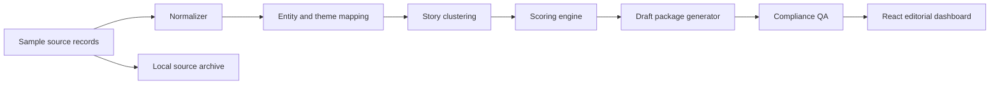
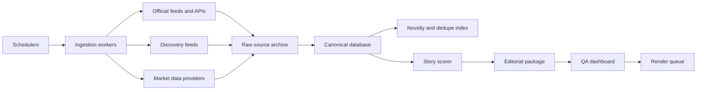

# Architecture

## Current MVP

## Production target

## Backend modules

- `app.models`: dataclass schemas for source items, story candidates, packages, and QA gates.
- `app.approval`: final approval checklist combining QA, claims, rights, and platform readiness.
- `app.pipeline.entity_mapping`: watchlist, source authority defaults, ticker and theme inference.
- `app.pipeline.scoring`: clustering and weighted story score.
- `app.pipeline.script_writer`: deterministic editorial package generator with format and style variation.
- `app.pipeline.compliance`: publish-readiness gates.
- `app.platform`: platform originality and reused-content readiness report.
- `app.source_archive`: append-only local JSONL archive for ingested source snapshots.
- `app.ingest.rss`: RSS ingestion adapter.
- `app.store`: in-memory MVP store.
- `app.main`: FastAPI endpoints.

## API surface

| Method | Path | Purpose |
| --- | --- | --- |
| `GET` | `/api/health` | Health check |
| `GET` | `/api/stories` | Ranked story slate |
| `POST` | `/api/stories/refresh` | Recompute slate |
| `GET` | `/api/stories/{story_id}` | Story detail |
| `POST` | `/api/stories/{story_id}/package` | Generate draft package |
| `GET` | `/api/stories/{story_id}/qa` | QA result |
| `GET` | `/api/stories/{story_id}/claims` | Claim-level source and editor-verification checklist |
| `GET` | `/api/stories/{story_id}/rights` | Source-rights and redistribution review report |
| `GET` | `/api/stories/{story_id}/platform-readiness` | Platform originality and reused-content readiness report |
| `GET` | `/api/stories/{story_id}/approval` | Final pre-publish approval checklist |
| `GET` | `/api/stories/{story_id}/decision` | Current editorial decision |
| `POST` | `/api/stories/{story_id}/decision` | Record approve, hold, revise, or archive decision |
| `GET` | `/api/stories/{story_id}/chart.svg` | Generated editorial signal chart |
| `GET` | `/api/stories/{story_id}/storyboard` | 60-second vertical render plan |
| `GET` | `/api/stories/{story_id}/captions.srt` | Draft subtitle file |
| `GET` | `/api/stories/{story_id}/preview.html` | Openable vertical review preview |
| `GET` | `/api/sources/catalog` | Configured official source feeds |
| `POST` | `/api/sources/rss` | Ingest an RSS feed |
| `GET` | `/api/sources/archive` | Local source archive status |

## CLI surface

| Command | Purpose |
| --- | --- |
| `python -m app.cli catalog` | List configured official source feeds |
| `python -m app.cli slate --limit 5` | Print the ranked story slate |
| `python -m app.cli package STORY_ID` | Generate one story package |
| `python -m app.cli qa STORY_ID` | Run QA for one story |
| `python -m app.cli export --output-dir exports/latest --limit 5` | Write editor briefs, manifests, QA, and package JSON |
| `python -m app.cli ingest-feed FEED_ID` | Pull one configured RSS feed |
| `python -m app.cli archive-status` | Show local source archive path and record count |

## Storage path

The MVP uses an in-memory store seeded from JSON. The next version should add Postgres tables:

- `source_items`
- `entities`
- `story_clusters`
- `story_candidates`
- `scripts`
- `qa_runs`
- `asset_manifests`
- `publish_jobs`

Add `jsonb` for raw provider payloads and `pgvector` later for novelty and dedupe.

## Audit trail

The MVP writes ingested source snapshots to an append-only JSONL archive. By default this lives at `.runtime/source_archive.jsonl`, or at `MARKET_SIGNAL_SOURCE_ARCHIVE` when configured. Each record includes the normalized source item, source URL, provenance, and ingest context.

The MVP also writes editorial decisions to an append-only JSONL ledger. By default this lives at `.runtime/decisions.jsonl`, or at `MARKET_SIGNAL_DECISION_LEDGER` when configured. The store loads the latest decision per story on startup, so approvals, holds, revision notes, and archive decisions survive local restarts.

Production should promote this into Postgres with:

- immutable raw source snapshots
- immutable append-only decision events
- authenticated editor identity
- old and new state
- QA snapshot
- source trail snapshot
- publish job linkage
