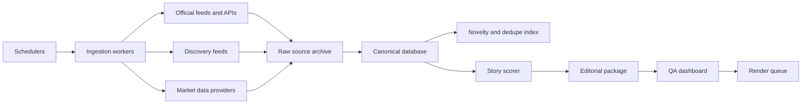

# Architecture

## Current MVP

## Production target

## Backend modules

- `app.models`: dataclass schemas for source items, story candidates, packages, and QA gates.
- `app.pipeline.entity_mapping`: watchlist, source authority defaults, ticker and theme inference.
- `app.pipeline.scoring`: clustering and weighted story score.
- `app.pipeline.script_writer`: deterministic editorial package generator.
- `app.pipeline.compliance`: publish-readiness gates.
- `app.ingest.rss`: RSS ingestion adapter.
- `app.store`: in-memory MVP store.
- `app.main`: FastAPI endpoints.

## API surface

| Method | Path | Purpose |
| --- | --- | --- |
| `GET` | `/api/health` | Health check |
| `GET` | `/api/stories` | Ranked story slate |
| `POST` | `/api/stories/refresh` | Recompute slate |
| `GET` | `/api/stories/{story_id}` | Story detail |
| `POST` | `/api/stories/{story_id}/package` | Generate draft package |
| `GET` | `/api/stories/{story_id}/qa` | QA result |
| `POST` | `/api/sources/rss` | Ingest an RSS feed |

## Storage path

The MVP uses an in-memory store seeded from JSON. The next version should add Postgres tables:

- `source_items`
- `entities`
- `story_clusters`
- `story_candidates`
- `scripts`
- `qa_runs`
- `asset_manifests`
- `publish_jobs`

Add `jsonb` for raw provider payloads and `pgvector` later for novelty and dedupe.

